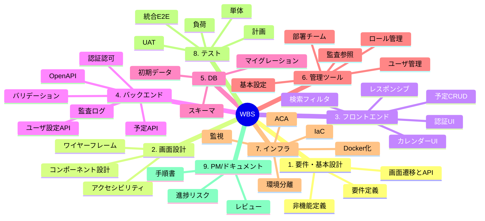

# WBS — スケジュール管理Webアプリ（Mermaid）

<!-- copilot-instructionsのルールを確認しました！ -->
<!-- estimate.instructions.mdのルールを確認しました！ -->

以下はMermaidのMindmapで表現したWBSです。

補足:
- 必要に応じて各葉ノードをチケット粒度（1〜3日）に分解し、所要を `01_Estimate/estimate_20250824_1015_ScheduleApp_Azure.md` の工数と整合させてください。
- Mermaidのmindmapは実験的機能のため、表示環境により描画差異が出る場合があります。
