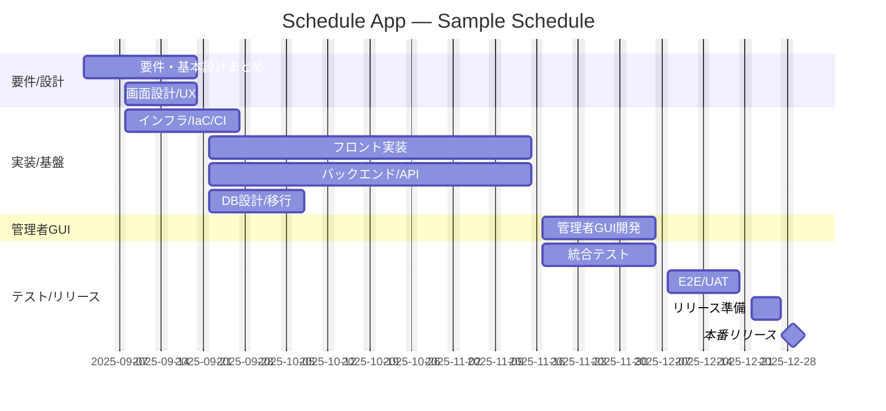

# サンプルスケジュール（Mermaid Gantt）— スケジュール管理Webアプリ

<!-- copilot-instructionsのルールを確認しました！ -->
<!-- estimate.instructions.mdのルールを確認しました！ -->

補足:
- 週末除外設定により、所要日数は営業日ベースで計算されます。
- 実カレンダーに合わせて祝日などを `excludes` に追加してください。
